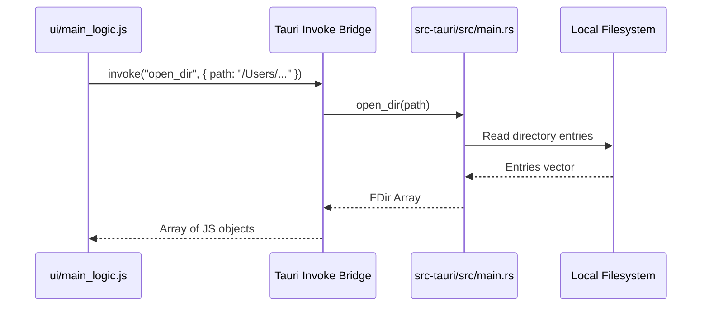

# AI Developer & Agent Onboarding Guide (AGENTS.md)

Welcome, agent! This document serves as your technical manual and architectural reference for developing, debugging, and extending **CoDriver**. Refer to this guide to align with existing design patterns, technology choices, and structural constraints.

For a comprehensive, deep-dive architectural reference covering module trees, Tauri IPC command descriptions, frontend global state variables, and end-to-end data flows (such as conflict resolution paste and AI integrations), please refer to [CONTEXT.md](file:///Users/rickyperlick/Coding/CoDriver/CONTEXT.md).

---

## 🚀 Repository Identity & Mission

**CoDriver** is a high-performance, cross-platform desktop file explorer built with **Tauri v2** and **Rust**.
- **No path caching**: Directory exploration is done in real-time, relying on the raw speed of Rust, concurrent disk access (`rayon` & `jwalk`), and CPU power.
- **Cross-platform**: Native feel on Windows, macOS, and Linux.
- **Rich features**: Includes dual-pane layout, miller columns, quick file preview (images, PDFs, video, code), drag-and-drop, multi-format archive compression/extraction, SSHFS mount integration, and Gemini AI-powered features (like image background removal).

---

## 📂 Directory Structure

Here is a map of the repository's major files and folders:

```
CoDriver/
├── .vscode/               # Workspace settings for VS Code
├── .zed/                  # Workspace settings for Zed
├── arch/                  # Architecture-specific scripts/files
├── docs/                  # Specifications, plans, release notes, and documentation
│   ├── design/            # UI/UX mockups and feature specs
│   └── superpowers/       # Active sprint specifications and plans
├── memories/              # AI-agent working state and project context
│   └── project_context.md # High-level summary of active sprints and tech stacks
├── snap/                  # Snap packaging configurations (Linux)
├── src-tauri/             # Rust backend code (Tauri Core)
│   ├── src/
│   │   ├── applications.rs # Desktop application integration helpers
│   │   ├── main.rs         # Entry point, state, and Tauri command declarations (heavy)
│   │   ├── utils.rs        # Heavy duty FS operations, watchers, compression
│   │   └── window_tauri_ext.rs # Platform window custom styling integrations
│   ├── Cargo.toml         # Rust crate dependency map
│   └── tauri.conf.json    # Tauri configuration (window sizes, allowlists, assets)
├── ui/                    # Frontend assets loaded by Tauri (Vanilla JS + jQuery)
│   ├── index.html         # Main app shell & modal containers
│   ├── main_logic.js      # Core UI state manager and operation orchestration (heavy)
│   ├── events.js          # Global listeners for Tauri-emitted backend events
│   ├── contextmenu.js     # Custom right-click menu management
│   ├── utils.js           # Shared DOM and IPC helpers
│   ├── models.js          # Core JS model definitions (e.g. ActiveAction, Popups)
│   └── style.css          # Premium glassmorphism design system & styles
├── CONTEXT.md             # Technical & architectural reference document (deep-dive)
└── README.md              # Public orientation document
```

---

## 💻 Tech Stack & Architecture

### 1. The Frontend (ui/)
- **Core UI Structure**: Single-page application built on pure HTML5 and vanilla CSS.
- **DOM Orchestration**: Uses **jQuery** (`$`) for event handling, animations, and DOM manipulation. Avoid introducing complex front-end frameworks (React, Vue, etc.) as the project structure relies on global namespace orchestration.
- **Visual Design**: Sleek glassmorphism theme defined in `ui/style.css` leveraging modern CSS variables (e.g., `--primaryColor`, `--textColor`, `--glass-blur`). Features responsive grid/list/miller layouts.
- **Third-Party Libraries**:
  - `DragSelect` (`ds.min.js`) for click-and-drag file selections.
  - `Font Awesome` (`font-awesome/`) for clean iconography.

### 2. The Backend (src-tauri/)
- **Core**: **Tauri v2** (Tauri v2 has been adopted for the codebase).
- **Disk Walking**: **jwalk** and **walkdir** for highly parallel directory traversals.
- **Concurrency**: **rayon** for multi-threaded operation mapping.
- **FS Watching**: **notify** crate registers platform-specific filesystem watchers to push live updates to the UI.
- **Archive Integrations**: `sevenz-rust`, `zip`, `tar`, `flate2`, `zstd`, `brotlic`, `density-rs`.

---

## 🔄 IPC & Tauri Command Integration

Communication between the frontend and the backend is done via Tauri's IPC bridge.



### IPC Convention
1. **Rust Command Declaration** (`src-tauri/src/main.rs`):
   ```rust
   #[tauri::command]
   fn your_command_name(custom_argument: String) -> Result<String, String> {
       // Backend logic
       Ok("Success".into())
   }
   ```
2. **Registration**: Ensure your command is registered inside the `.invoke_handler` list in `main.rs`:
   ```rust
   .invoke_handler(tauri::generate_handler![
       list_dirs,
       // ...
       your_command_name
   ])
   ```
3. **JS Invocation** (`ui/main_logic.js`):
   Tauri bridges snake_case Rust arguments to camelCase JS properties automatically.
   ```javascript
   const result = await invoke("your_command_name", { customArgument: "value" });
   ```

---

## 🎨 UI & Styling Guidelines

To maintain visual excellence, follow these rules:
1. **Glassmorphism Theme**: Always utilize the design system's variables from `style.css` rather than static colors.
   ```css
   background: var(--glass-bg);
   border: var(--glass-border);
   backdrop-filter: var(--glass-blur);
   ```
2. **Unified Modals & Popups (`.props-card`)**: Refrain from using crude custom layouts or old `.uni-popup` overlays. All interactive modal dialogs (such as Properties, Compress, Extract, Delete Confirm, and FTP Connection) must inherit from the `.props-card` design pattern:
    - **Hero Header (`.props-card__hero`)**: Houses a `.props-card__thumb` holding a dedicated Font Awesome icon (or a circular progress loader styled with `.preloader-small-invert` for ongoing processes), and a `.props-card__heading` containing the `.props-card__name` (title) and `.props-card__meta` (subtext or `.props-card__chip` labels).
   - **Form Grid Items (`.props-card__list`)**: Wrapped in a `<dl>` list using `<div class="props-card__row">` grid containers (`88px 1fr` layout split). Labels (`<dt class="props-card__label">`) should feature small, clean icons. Value fields (`<dd class="props-card__value">`) house high-contrast text inputs, number fields, or dropdown select boxes styled with the `.props-card__input` class.
   - **Form Layout**: Prefer simple vertical stacking for multiple inputs over dynamic horizontal row division to avoid alignment splits and wrap breaks.
   - **Structured Footer (`.props-card__footer`)**: Placed at the bottom holding primary and secondary buttons styled with `.props-card__btn` and `.props-card__btn--primary`.
   - **Display Activation (JS)**: When showing the modal, always invoke `.style.display = "flex"` (never `"block"`) to allow the card's native flexbox and stretch behaviors to function.
3. **Prevent Placeholder Assets**: When displaying visual helpers, do not use dead layout placeholders. Generate or use proper icon sheets and local resources found in `ui/resources/` or `ui/font-awesome`.
4. **Asynchronous Previews & Circular Loaders**: When displaying large or heavy preview elements (such as PDF files) in modals, avoid setting the resource source immediately inside the HTML template to prevent the UI from freezing. Instead:
   - Immediately display the modal container with a centered circular progress loader (using the style of the indicators from the action items, e.g. `.preloader-invert` or `.preloader-small-invert`).
   - Load the resource asynchronously in the background by dynamically setting the target element's `src` attribute.
   - Listen to the `"load"` event of the element, and once fired, hide the loading indicator, make the preview visible, and transition the background properties (e.g. to a solid white background for high PDF legibility).

---

## 🛠️ Key Developer Workflows & Recipes

### 1. Working with Paths
> [!CAUTION]
> **Path Separator Trap**: Paths are highly platform-dependent. Always normalize paths by replacing double-backslashes `\\` with forward slashes `/` where appropriate on the frontend, and verify that your path adjustments are Windows-safe.

### 2. State & Focus Flags
When implementing new keyboard shortcuts or popups, protect the global UI namespace by checking the state flags in `main_logic.js`:
- `IsPopUpOpen`: Set to `true` when a modal/popup is visible. Prevents general explorer keyboard events (like navigating or deleting) from triggering.
- `IsInputFocused`: Set to `true` when an `<input>` is active. Prevents search shortcuts or navigation commands from intercepting typing.
- `IsDisableShortcuts`: Use to globally silence key interception.

### 3. File Operations & Progress Bars
File operations are handled asynchronously to keep the UI smooth:
- Selecting items buffers them in `ArrSelectedItems` or `ArrCopyItems` (for copy/cut).
- Invoking `arr_copy_paste` runs chunked operations in the Rust backend.
- Rust emits events like `"update-progress-bar"` and `"finish-progress-bar"` which are picked up in `ui/events.js` to update the `.active-actions-container` layout.
- Dismissing the detailed progress modal via **Run in Background** tracks progress silently. Users can click on a progress action item within the active actions popup to invoke `reopenProgressModal()`, which resets the dismissal state, closes the active actions popup, and opens the detailed progress modal populated with live data.

### 4. Running a Local Build
Ensure you have the tauri-cli installed:
```bash
cargo install tauri-cli
```
Run the development environment locally:
```bash
cargo tauri dev
```

---

## 🤖 AI Guidelines & Prompt Engineering

When developing or debugging this repository, you should prioritize:
1. **Vanilla Style Preservation**: Do not attempt to refactor the jQuery layout into modern JS frameworks (React, Vue, Svelte) unless explicitly requested.
2. **Keep Calculations in Rust**: Heavy calculations, recursive walks, filtering, and heavy text parsing should always reside on the Rust backend (`utils.rs` or `main.rs`) to maintain high desktop performance.
3. **Graceful IPC Failures**: Always wrap Tauri commands in JS `try/catch` and display human-readable notifications using the global toast notification functions:
   ```javascript
   showToast("Action failed: " + error, ToastType.ERROR);
   ```
4. **Respect AI Provider Selection**: Do not hardcode a specific AI provider (such as Gemini or OpenAI). Always check the active `ai_provider` configuration (e.g. the global `AiProvider` on the frontend, and the settings map in `app_config.json` on the backend). AI commands must query the selected provider and model to ensure user settings and keychain API keys are fully respected.

