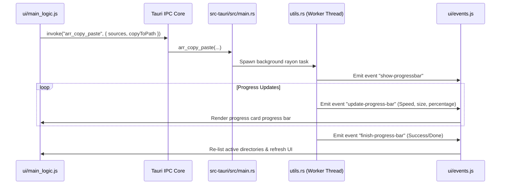

# CoDriver Technical & Architectural Context (CONTEXT.md)

Welcome, developer or AI agent! This document serves as the **deep-dive architectural reference** and reverse-engineered technical guide for **CoDriver**. If you are looking for styling conventions or the high-level onboarding manual, please see [AGENTS.md](file:///Users/rickyperlick/Coding/CoDriver/AGENTS.md). 

CoDriver is a high-performance, cross-platform desktop file explorer built with a **Tauri v2** backend (Rust) and an extremely fast, static **jQuery** frontend (HTML5/CSS3). It does *no path caching*, resolving directories in real-time on top of parallel disk-walking and low-level system integrations.

---

## 📂 System Directory & Module Guide

Here is a comprehensive breakdown of the core modules and key files in the repository:

### 1. Tauri Backend (`src-tauri/`)
- **`src/main.rs`**: The massive central orchestration file. It contains the entry point, registers Tauri v2 plugins (clipboard manager, dialog, fs, os, http, cli, drag), configures the Mac title bar and transparent window effects, manages global lazy-static states, declares and handles over 50 Tauri IPC commands, and loads/saves configurations (`app_config.json`).
- **`src/utils.rs`**: Core high-performance filesystem and system logic. Implements:
  - Recursive directory tree walking with **`jwalk`** and file size calculation.
  - Chunked asynchronous copy and move algorithms with real-time transfer-speed calculations.
  - File compression and extraction integrations for Zip, Tar, Gz, Bz2, Zst, Brotli, and Density archives.
  - Asynchronous system filesystem watcher registration using the **`notify`** crate.
  - Detailed active background process tracking (`ActiveAction`).
- **`src/applications.rs`**: OS-level application integrations. Fetches installed desktop apps and runs `open_file_with` bindings to launch documents.
- **`src/window_tauri_ext.rs`**: Custom macOS window integrations like transparent title bars and traffic light repositioning.
- **`src/remote/mod.rs` & `ftp.rs`**: Remote connection orchestrators. `ftp.rs` contains in-memory stream caches (`FTP_CONNECTIONS`) and FTP client adapters for recursive folder traversal, downloading, uploading, and deleting items over FTP.

### 2. jQuery Frontend (`ui/`)
- **`ui/index.html`**: The main application window shell. It houses the top header navigation, search and filter bars, left-hand sidebar navigation (favorites, disks, remotes), the main dual-pane content grid/list area, modal containers (properties, active processes, AI prompts), and the instant quicksearch element.
- **`ui/main_logic.js`**: The frontend nerve center. Orchestrates navigation transitions (grid, list, miller columns), buffers selections, handles clipboard actions, manages custom shortcut bindings, queries Tauri IPC interfaces, and handles all popups/modals.
- **`ui/events.js`**: Maps system-wide Tauri event notifications (e.g. progressive file search results, file-thumbnail decoders, live watcher events, and file operation progress meters) into DOM mutations.
- **`ui/contextmenu.js`**: Manages the custom context menu (`CDContextMenu` class), dynamically toggling entries (like Paste, Extract, Compress, and properties) depending on whether files, directories, remote files, or empty spaces are selected.
- **`ui/utils.js`**: Shared helpers for styling, string formatting, DOM traversal, and platform-specific path corrections.
- **`ui/models.js`**: Declares client-side state constants like `ActiveAction`, `PopupType`, and `ToastType`.
- **`ui/style.css`**: The premium glassmorphism styling stylesheet. Dictates modern typography, scrollbars, flex grids, and unified modal cards (`.props-card`).

---

## 🔄 Tauri IPC Command Reference

The table below lists the essential Tauri backend commands declared in `src/main.rs`, their parameters, and their purposes:

| Command | Parameters | Return Type | Description |
| :--- | :--- | :--- | :--- |
| `list_dirs` | None | `Vec<FDir>` | Reads and returns files and folders of the active Rust working directory. |
| `open_dir` | `path: String` | `Vec<FDir>` | Changes the current working directory to `path` and lists its entries. |
| `open_item` | `path: String` | `Result<(), String>` | Opens a file using the host OS default handler. |
| `list_disks` | None | `Vec<DisksInfo>` | Detects local disks, external volumes (`/Volumes`), active SSHFS mounts, and active FTP remotes. |
| `mount_sshfs` | `config: SSHFSConfig` | `Result<String, String>` | Mounts a remote system via SSHFS into a `/tmp` mount point. |
| `connect_ftp` | `config: FtpConfig` | `Result<String, String>` | Establishes a persistent TCP stream connection to a remote FTP host. |
| `disconnect_ftp`| `name: String` | `Result<(), String>` | Closes the active FTP connection stream. |
| `arr_copy_paste`| `sources: Vec<String>`, `is_for_dual_pane: bool`, `copy_to_path: String` | `Result<(), String>` | Spawns a background thread to copy selected files/folders asynchronously. |
| `arr_copy_paste_resolved` | `sources: Vec<String>`, `is_for_dual_pane: bool`, `copy_to_path: String`, `conflicts: Vec<CopyConflictItem>` | `Result<CopyPasteResolvedResult, String>` | Handles copy operations where destination conflicts have been explicitly resolved by the user. |
| `arr_delete_items`| `sources: Vec<String>` | `Result<(), String>` | Deletes selected paths in parallel using the `delete` and `remove_dir_all` crates. |
| `find_duplicates` | `path: String`, `max_depth: Option<usize>` | `Result<Vec<DuplicateGroup>, String>` | Scans a directory recursively for files of identical sizes and byte-hashes. |
| `ai_upscale_image` | `ai_provider: String`, `api_key: String`, `from_path: String`, `aspect_ratio: String`, `output_path: String`, `creative: bool` | `Result<(), String>` | Prompts Gemini or OpenAI to perform high-resolution creative upscaling. |
| `ai_get_organizer_suggestions` | `path: String` | `Result<OrganizerSuggestions, String>` | Asks Gemini/OpenAI to analyze folder structures and suggest categorized directories. |
| `ai_execute_organize` | `mappings: Vec<OrganizeMapping>` | `Result<(), String>` | Executes the semantic sorting suggested by the AI Organizer. |
| `get_capped_selection_size` | `paths: Vec<String>`, `limit_bytes: u64` | `SimpleDirInfo` | Computes selected size and stops if limit is breached to keep UI snappy. |
| `setup_fs_watcher` | None | None | Spins up the cross-platform filesystem watcher thread. |

---

## 🧠 Core State & Namespace Orchestration

The frontend application keeps its execution clean by guarding the global jQuery space with state flags in `ui/main_logic.js`. Below are the primary state flags that any developer or agent **must** respect before implementing new features or hooks:

### 1. View & Focus Flags
- **`IsPopUpOpen`**: Set to `true` whenever an overlay modal (settings, properties, prompt, delete-confirmation) is visible. General keyboard navigation shortcuts are ignored while `IsPopUpOpen` is active.
- **`IsInputFocused`**: Toggled to `true` when focus enters `<input>`, `<textarea>`, or `<select>` controls. Blocks key event listeners (like quicksearch or action bindings) from triggering when typing.
- **`IsDisableShortcuts`**: Globally silences all standard explorer key interception. Perfect for onboarding, settings customization, or heavy asynchronous processes.
- **`SelectedElement`**: Refers to the active DOM element highlight in the directory container.
- **`SelectedItemPaneSide`**: `"left"` or `"right"`. Tracks which window has active keyboard focus during dual-pane operations.

### 2. Selection & Clipboard Buffers
- **`ArrSelectedItems`**: Array of DOM elements currently selected by the user. Used for batch copies, compressions, deletions, or bulk rename configurations.
- **`ArrCopyItems`**: Stores an array of paths that have been copied/cut and are waiting to be pasted.
- **`IsCopyToCut`**: Boolean representing if buffered copy items are meant to be moved (`true` for Cut/Move, `false` for Copy).
- **`IsFileOpIntern`**: Ensures dragging and dropping files inside CoDriver handles operations internally rather than triggering OS-level shell attachments.

---

## 🌊 Key Operations & End-to-End Data Flows

### 1. Folder Navigation & Miller Columns
When a directory is opened, CoDriver coordinates a sleek visual flow:
1. JavaScript invokes Tauri's `open_dir` or `list_dirs` command.
2. Rust walks the target directory synchronously and builds a `Vec<FDir>` list.
3. JavaScript parses the returned JSON and renders layout elements:
   - **Grid/List View**: Injects visual list wrappers inside columns (`#main-dir-container`).
   - **Miller Columns**: Dynamically builds next-level column list cards side-by-side as you dive deeper into subfolders.

### 2. Asynchronous Paste with Conflict Resolution
File replication manages massive files seamlessly through Rust threads and JS event loops:



If conflicts are encountered (duplicate file names), `arr_copy_paste_resolved` allows user policies to override actions, e.g., Replace, Merge, Duplicate, Skip.

### 3. SSHFS and FTP Remote Mounts
Remote folders blend directly into local navigation:
- **SSHFS**: Tauri's `mount_sshfs` issues shell mounts under a private directory `/tmp/codriver-sshfs-mount/` on Mac and Linux. The filesystem watcher registers this directory path, dynamically firing `fs-mount-changed` events to add network icons to the disks list.
- **FTP remotes**: Persisted on the Rust backend within a thread-safe mutex map `remote::ftp::FTP_CONNECTIONS`. Directory listings (`list_dirs`) look for the `ftp://` prefix, routing file manipulations and stream retrievals directly through the cached `FtpStream` instance to guarantee near-instant remote browsing.

### 4. Duplicate Finder Workflow
1. User enters the duplicate search prompt on a folder.
2. JS calls `find_duplicates(path)`.
3. Rust backend initializes `IS_DUP_FIND_CANCELLED` to `false`.
4. Backend runs `jwalk` to recursively group all candidate files by their exact sizes.
5. Rayon threads compute partial hashes (first 16 KB) for candidate groups. If partial hashes match, a full byte-hash is computed.
6. Group results are returned to the frontend where they are shown in the properties dialog, allowing users to choose which copies to discard.

### 5. Gemini & OpenAI Powered Superpowers
AI integrations provide incredible visual and structural automation:
- **Upscaling & Styling**: Vision capabilities process local assets:
  1. The selected image is read into a base64 string on the backend.
  2. A detailed vision description prompt is built.
  3. The vision prompt is transmitted to Gemini (`gemini-3.1-flash-image-preview` / `gemini-3.5-flash` etc.) or OpenAI (`gpt-4o`/`gpt-image-2`).
  4. The model returns a base64 generated upscale or style, which Rust writes to the output path, triggering a UI listing refresh.
- **AI Organizer**: Reads files in a directory, queries the AI text model with a directory map representation, and receives a JSON directory structure. The user reviews these directories inside a checklist popup (`.organizer-group-card`) and commits files, triggering bulk `ai_execute_organize` moves.

---

## 🎨 Unified Modals & Styling Guidelines

CoDriver achieves its premium, native feel via a structured glassmorphism design language. All modals and inputs MUST inherit the **`.props-card`** design framework:

### The `.props-card` Layout
```html
<div class="props-card" style="display: flex;">
  <!-- 1. Hero Header -->
  <div class="props-card__hero">
    <div class="props-card__thumb">
      <i class="fa-solid fa-folder-open"></i> <!-- Font Awesome Icon -->
    </div>
    <div class="props-card__heading">
      <h3 class="props-card__name">Modal Title</h3>
      <span class="props-card__meta">Subtext or active chip details</span>
    </div>
  </div>

  <!-- 2. Form Grid List -->
  <dl class="props-card__list">
    <div class="props-card__row">
      <dt class="props-card__label">
        <i class="fa-solid fa-server"></i> Host
      </dt>
      <dd class="props-card__value">
        <input type="text" class="props-card__input" placeholder="ftp.example.com" />
      </dd>
    </div>
  </dl>

  <!-- 3. Action Footer -->
  <div class="props-card__footer">
    <button class="props-card__btn props-card__btn--secondary">Cancel</button>
    <button class="props-card__btn props-card__btn--primary">Connect</button>
  </div>
</div>
```

> [!IMPORTANT]
> When rendering or opening a `.props-card` overlay via JavaScript, always set the container element style display to `flex` (never `block`). This allows the card's premium flex layout and scrolling systems to render correctly.

---

## 🛠️ Developer & Build Workflows

### 1. Working with Path Traps
Paths are highly OS-dependent. To ensure full compatibility across Windows, Mac, and Linux:
- Always normalize double backslashes `\\` into forward slashes `/` on the Javascript client.
- Leverage Tauri's built-in platform APIs (`TAURI.os.platform`) to construct custom terminal commands.

### 2. Custom Hotkey Mappings
Hotkeys are dynamically map-checked in the key listener:
- Configuration maps are stored inside `app_config.json` under `shortcuts`.
- Custom recorded shortcuts call the matching utility `matchShortcut("action_name", e)`.

### 3. Local Development Command List
To start hacking on the codebase:
- Install the Tauri v2 CLI: `cargo install tauri-cli`
- Spin up the development server with live reload: `cargo tauri dev`
- Compile production bundles: `cargo tauri build`
