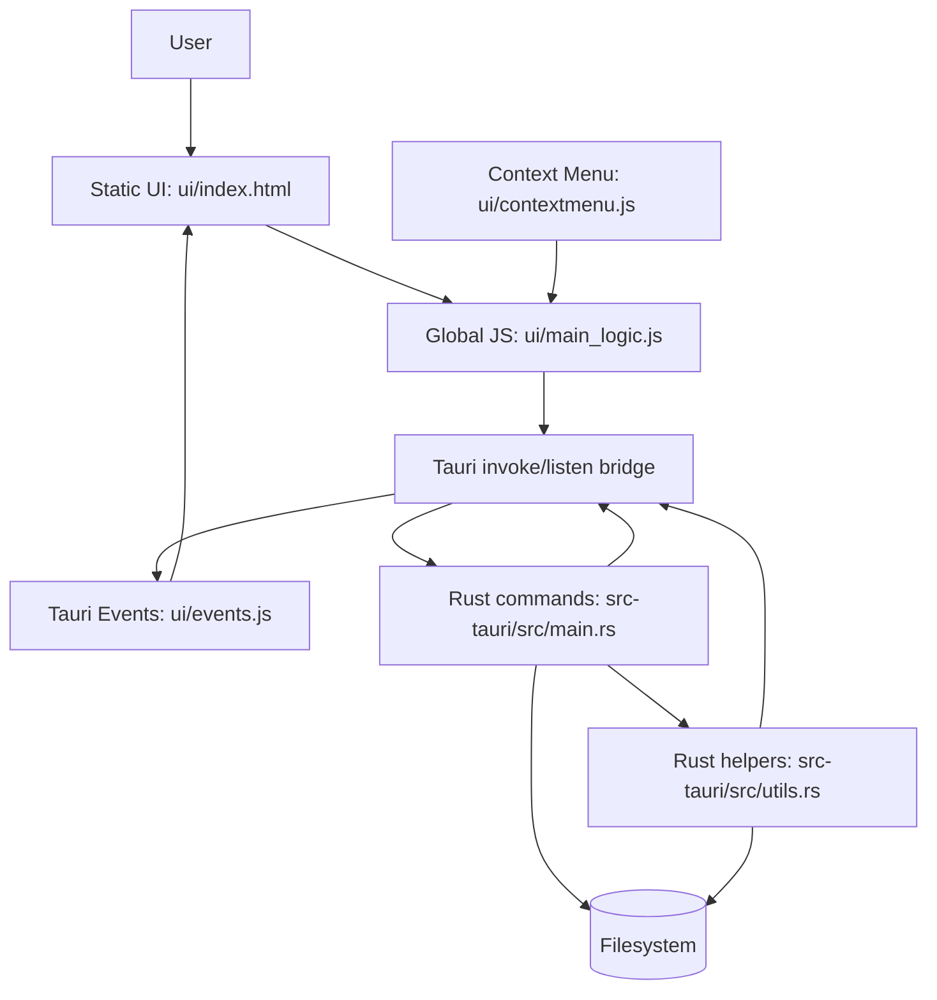

# CoDriver Architecture

CoDriver is a Tauri desktop file explorer. The frontend is a static HTML/JavaScript app in `ui/`; the backend is a Rust Tauri command layer in `src-tauri/`.

## Documentation Map
- `arch/context.md`: project context for feature work.
- `arch/components/file-operations.md`: copy/move architecture and conflict feature notes.
- `arch/components/relationships.md`: component dependencies.
- `arch/data/models.md`: important data shapes and global state.
- `arch/data/flows.md`: data flows.
- `arch/api/contracts.md`: Tauri command contracts relevant to file ops.
- `arch/api/sequences.md`: command sequences.
- `arch/diagrams/architecture.md`, `flow.md`, `sequence.md`: Mermaid diagrams.
