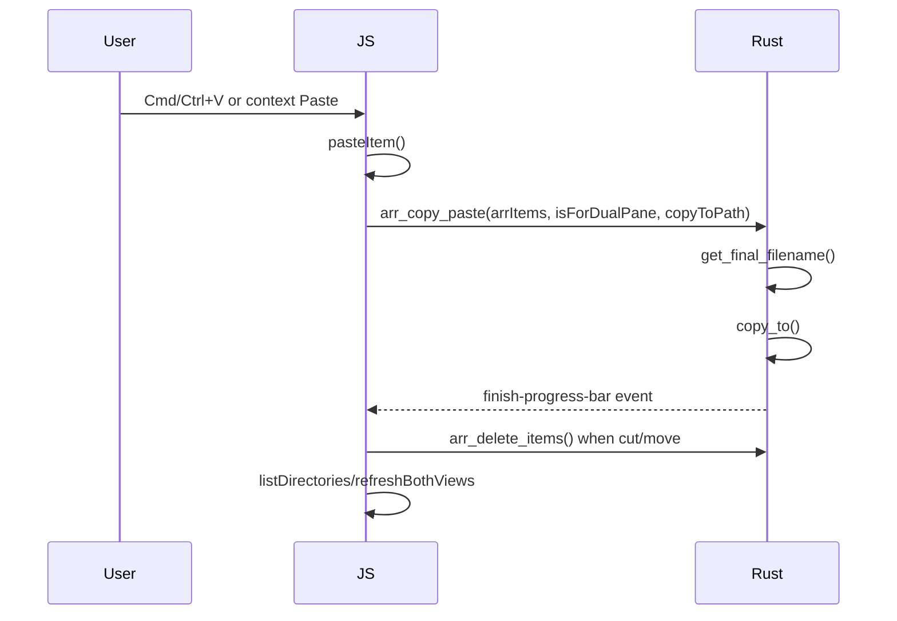
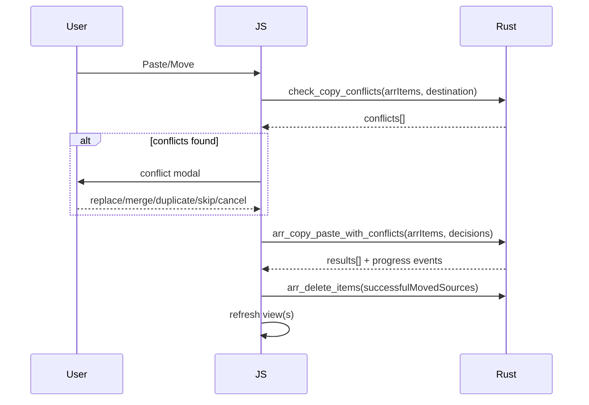

# API Sequences

## Current Paste Sequence

```mermaid
sequenceDiagram
    User->>JS: Cmd/Ctrl+V or context Paste
    JS->>JS: pasteItem()
    JS->>Rust: arr_copy_paste(arrItems, isForDualPane, copyToPath)
    Rust->>Rust: get_final_filename()
    Rust->>Rust: copy_to()
    Rust-->>JS: finish-progress-bar event
    JS->>Rust: arr_delete_items() when cut/move
    JS->>JS: listDirectories/refreshBothViews
```

## Proposed Conflict Sequence

```mermaid
sequenceDiagram
    User->>JS: Paste/Move
    JS->>Rust: check_copy_conflicts(arrItems, destination)
    Rust-->>JS: conflicts[]
    alt conflicts found
        JS->>User: conflict modal
        User-->>JS: replace/merge/duplicate/skip/cancel
    end
    JS->>Rust: arr_copy_paste_with_conflicts(arrItems, decisions)
    Rust-->>JS: results[] + progress events
    JS->>Rust: arr_delete_items(successfulMovedSources)
    JS->>JS: refresh view(s)
```
