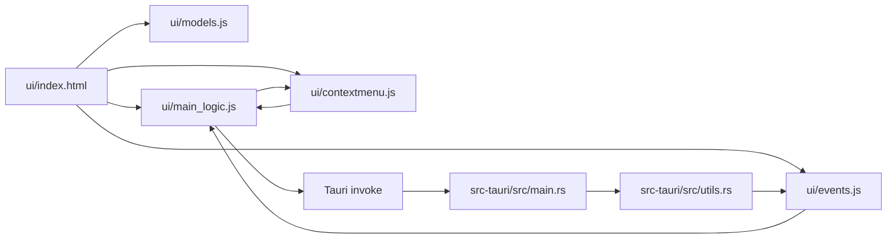

# Component Relationships

## Notes
- Script ordering matters: `models.js` defines `PopupType`; `main_logic.js` consumes it; `contextmenu.js` calls functions defined globally.
- UI state is shared mutable globals, not a component framework/store.
- Backend emits events that mutate DOM/progress state through `ui/events.js`.
