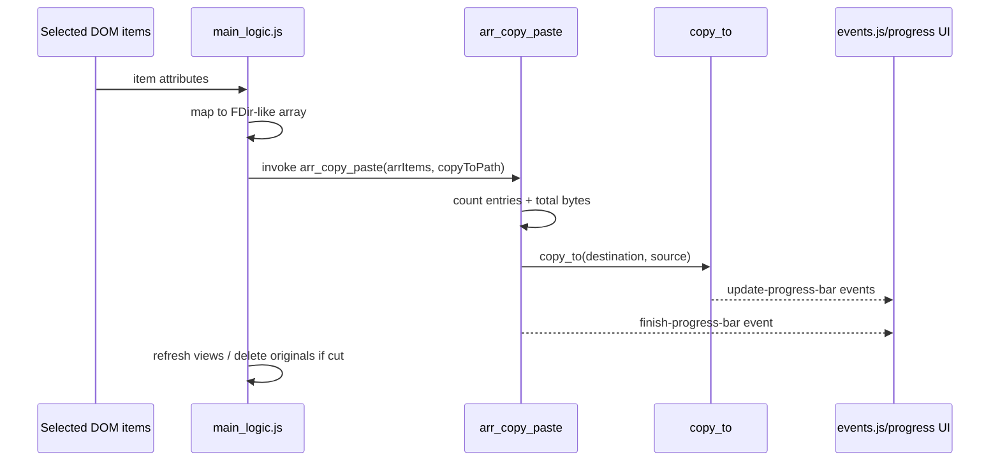
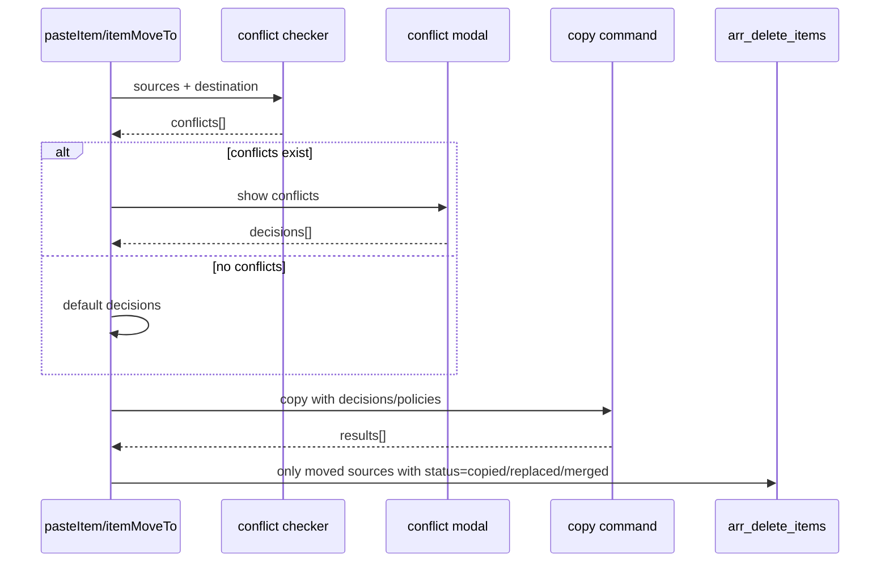

# Data Flows

## Copy/Cut/Paste Data Flow

```mermaid
sequenceDiagram
    participant DOM as Selected DOM items
    participant JS as main_logic.js
    participant Rust as arr_copy_paste
    participant Util as copy_to
    participant UI as events.js/progress UI

    DOM->>JS: item attributes
    JS->>JS: map to FDir-like array
    JS->>Rust: invoke arr_copy_paste(arrItems, copyToPath)
    Rust->>Rust: count entries + total bytes
    Rust->>Util: copy_to(destination, source)
    Util-->>UI: update-progress-bar events
    Rust-->>UI: finish-progress-bar event
    JS->>JS: refresh views / delete originals if cut
```

## Conflict Resolution Data Flow

```mermaid
sequenceDiagram
    participant JS as pasteItem/itemMoveTo
    participant Check as conflict checker
    participant Modal as conflict modal
    participant Rust as copy command
    participant Delete as arr_delete_items

    JS->>Check: sources + destination
    Check-->>JS: conflicts[]
    alt conflicts exist
        JS->>Modal: show conflicts
        Modal-->>JS: decisions[]
    else no conflicts
        JS->>JS: default decisions
    end
    JS->>Rust: copy with decisions/policies
    Rust-->>JS: results[]
    JS->>Delete: only moved sources with status=copied/replaced/merged
```
