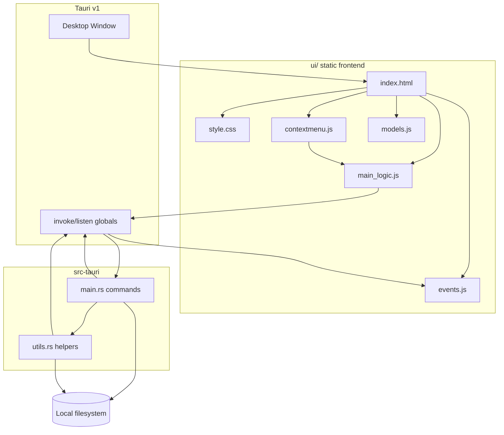

# Architecture Diagram

```mermaid
graph TB
    subgraph Frontend[ui/ static frontend]
        HTML[index.html]
        CSS[style.css]
        Main[main_logic.js]
        Ctx[contextmenu.js]
        Events[events.js]
        Models[models.js]
    end

    subgraph Tauri[Tauri v1]
        Invoke[invoke/listen globals]
        Window[Desktop Window]
    end

    subgraph Backend[src-tauri]
        Cmd[main.rs commands]
        Util[utils.rs helpers]
    end

    FS[(Local filesystem)]

    HTML --> CSS
    HTML --> Models
    HTML --> Main
    HTML --> Ctx
    HTML --> Events
    Ctx --> Main
    Main --> Invoke
    Invoke --> Cmd
    Cmd --> Util
    Cmd --> FS
    Util --> FS
    Util --> Invoke
    Cmd --> Invoke
    Invoke --> Events
    Window --> HTML
```
