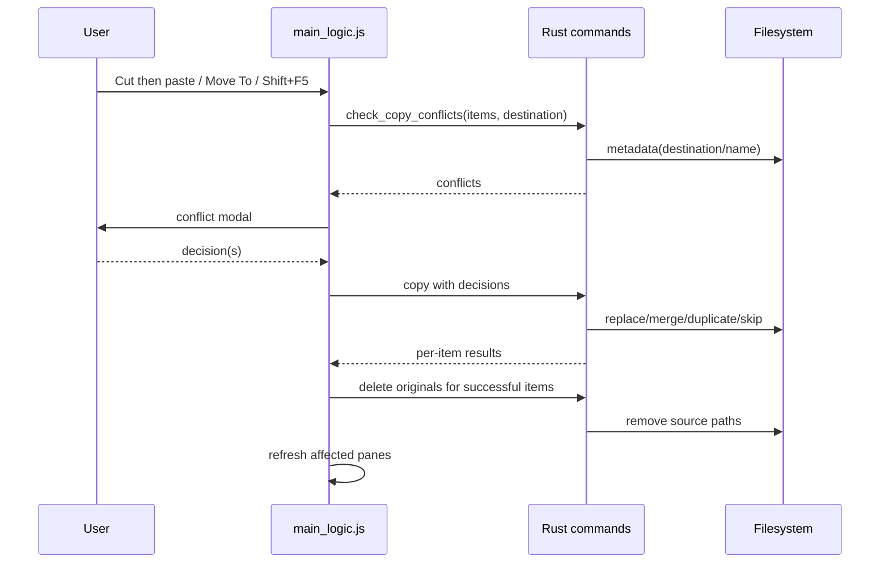

# Sequence Diagrams

## Conflict-Aware Move

```mermaid
sequenceDiagram
    participant User
    participant JS as main_logic.js
    participant Rust as Rust commands
    participant FS as Filesystem

    User->>JS: Cut then paste / Move To / Shift+F5
    JS->>Rust: check_copy_conflicts(items, destination)
    Rust->>FS: metadata(destination/name)
    Rust-->>JS: conflicts
    JS->>User: conflict modal
    User-->>JS: decision(s)
    JS->>Rust: copy with decisions
    Rust->>FS: replace/merge/duplicate/skip
    Rust-->>JS: per-item results
    JS->>Rust: delete originals for successful items
    Rust->>FS: remove source paths
    JS->>JS: refresh affected panes
```
