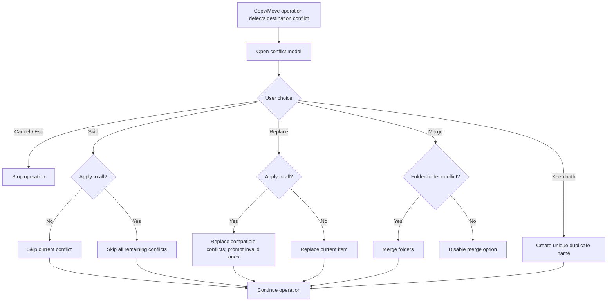

# Mockup: Copy/Move Destination Conflict Modal

## Desktop Layout

```text
┌──────────────────────────────────────────────────────────────┐
│ ⚠ Item already exists                         Conflict 1 of 4 │
├──────────────────────────────────────────────────────────────┤
│ “Report.pdf” already exists in the destination.              │
│                                                              │
│ ┌ Incoming item ────────────┐ ┌ Existing item ─────────────┐ │
│ │ Report.pdf                │ │ Report.pdf                 │ │
│ │ Modified Apr 26 • 2.4 MB  │ │ Modified Apr 20 • 2.1 MB   │ │
│ │ From: /Downloads          │ │ In: /Documents             │ │
│ └───────────────────────────┘ └────────────────────────────┘ │
│                                                              │
│ Choose what to do                                            │
│ ○ Replace existing item                                      │
│   Overwrite destination with incoming item.                   │
│ ○ Merge folders                                              │
│   Combine folder contents.                                   │
│ ● Keep both                                                  │
│   Create “Report copy.pdf”.                                  │
│                                                              │
│ ☐ Apply this choice to all remaining conflicts                │
├──────────────────────────────────────────────────────────────┤
│                         [✕ Cancel] [⏭ Skip] [✓ Continue]     │
└──────────────────────────────────────────────────────────────┘
```

## Mobile/Narrow Layout

```text
┌──────────────────────────────┐
│ ⚠ Item already exists        │
│ Conflict 1 of 4              │
├──────────────────────────────┤
│ “Report.pdf” already exists… │
│ ┌ Incoming item ───────────┐ │
│ │ Report.pdf               │ │
│ │ Modified Apr 26 • 2.4 MB │ │
│ └──────────────────────────┘ │
│ ┌ Existing item ───────────┐ │
│ │ Report.pdf               │ │
│ │ Modified Apr 20 • 2.1 MB │ │
│ └──────────────────────────┘ │
│ ○ Replace existing item      │
│ ○ Merge folders              │
│ ● Keep both                  │
│ ☐ Apply to all remaining     │
├──────────────────────────────┤
│ [✕ Cancel] [⏭ Skip]          │
│ [✓ Continue]                 │
└──────────────────────────────┘
```

## Interaction Flow


