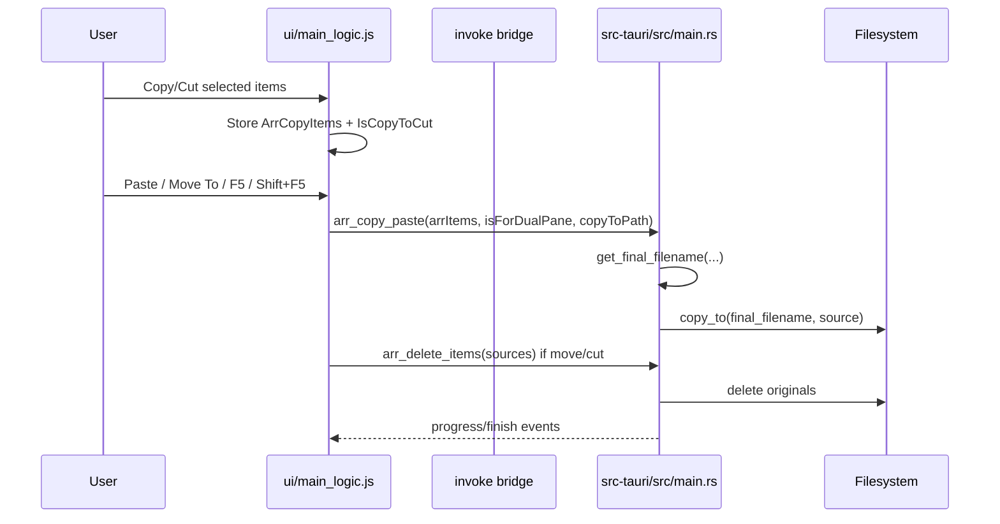

# Project Context

## Overview
CoDriver is a cross-platform desktop file explorer built with Tauri. It provides directory navigation, copy/cut/paste, delete, rename, compression/extraction, search, dual-pane mode, Miller columns, drag/drop, SSHFS mounts, and previews.

## Architecture Summary
The app uses a static web UI in `ui/` loaded directly by Tauri (`src-tauri/tauri.conf.json` `devPath`/`distDir`: `../ui`). Frontend logic is mostly global JavaScript functions and state in `ui/main_logic.js`, with event listeners in `ui/events.js`, context menu code in `ui/contextmenu.js`, and shared models/constants in `ui/models.js`. Backend commands live primarily in `src-tauri/src/main.rs`; reusable Rust helpers are in `src-tauri/src/utils.rs`.

## Key Components
- `ui/index.html`: static DOM shell, script load order, popup background, explorer containers, dual-pane containers, settings/search markup.
- `ui/main_logic.js`: core UI state and file operation orchestration. Key copy/move functions: `copyItem`, `pasteItem`, `itemMoveTo`, `showPopup`, `closeConfirmPopup`.
- `ui/contextmenu.js`: `CDContextMenu` class wiring context actions to global functions, including Copy, Cut, Paste, Move To.
- `ui/events.js`: Tauri event listeners for progress, refresh, file search, watcher updates.
- `ui/models.js`: `ActiveAction`, `PopupType`, `ToastType` constants.
- `ui/style.css`: custom CSS design system; `.uni-popup`, `.confirm-popup`, `.popup-background`, `.popup-controls` style modal patterns.
- `src-tauri/src/main.rs`: Tauri command registration and filesystem commands. Key commands: `arr_copy_paste`, `copy_paste`, `get_final_filename`, `arr_delete_items`, `delete_item`, `rename_element`.
- `src-tauri/src/utils.rs`: recursive/chunked copy helper `copy_to`, progress updates, directory walking, archive utilities, filesystem watcher.

## Data Flow
Copy/cut selection is stored in frontend globals (`ArrCopyItems`, `IsCopyToCut`, `ArrSelectedItems`). Paste builds an array of `FDir`-shaped objects and invokes Rust `arr_copy_paste`; move/cut then invokes `arr_delete_items`. Rust currently auto-generates duplicate names in `get_final_filename` (`name (1).ext`, etc.) and `copy_to` overwrites when passed an existing file path.

## Technology Stack
- Desktop shell: Tauri v1.6
- Backend: Rust 2021, Tokio, serde, jwalk, rayon, notify, archive/compression crates
- Frontend: static HTML/CSS/JavaScript, jQuery, Font Awesome, Tauri global APIs (`window.__TAURI__`)
- Build/release: `cargo tauri dev/build`; GitHub Actions uses `tauri-apps/tauri-action`
- Tests: no project-specific JS test runner found; Rust tests can be run with Cargo if added.

## Conventions
- Frontend uses global variables/functions, direct DOM mutation, jQuery helpers, and string-built HTML.
- Modal UX uses `.uni-popup` plus `.popup-background`; async decisions commonly return a Promise from `showPopup`.
- Tauri commands use snake_case Rust names invoked from JS with camelCase argument keys.
- File operation progress is emitted from Rust and handled in `ui/events.js`.
- Paths are frequently normalized by replacing `\\` with `/`; avoid assumptions that break Windows.

## Current Sprint/Focus
Upcoming feature: before copy/move overwrites/duplicates existing destination names, detect conflicts and show a modal that lets user choose replace, merge, duplicate, skip/cancel. Scope should cover paste, dual-pane F5/Shift+F5, context-menu Paste, Move To, and drag/drop paste paths.

## Key Decisions
- Prefer frontend conflict discovery + modal because user decisions are UI concerns and existing modal patterns are frontend-only.
- Add backend support for explicit conflict policy rather than overloading `get_final_filename`; current backend always duplicates by generating `name (n)`.
- Keep Rust copy/delete responsible for filesystem mutation and progress; keep JS responsible for building per-item decisions and refreshing views.
